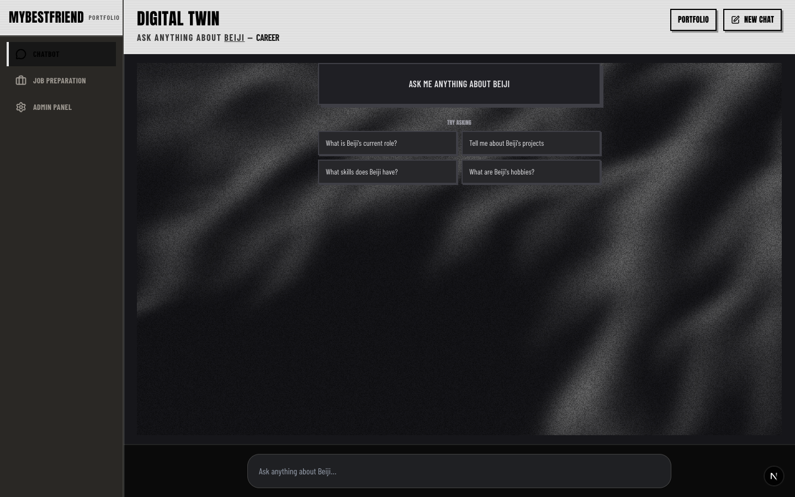
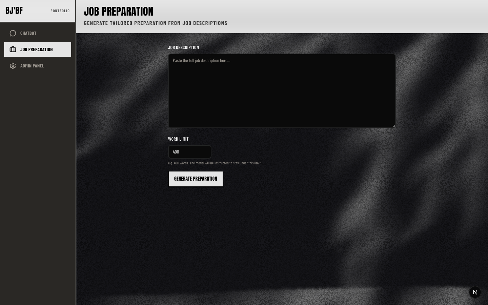
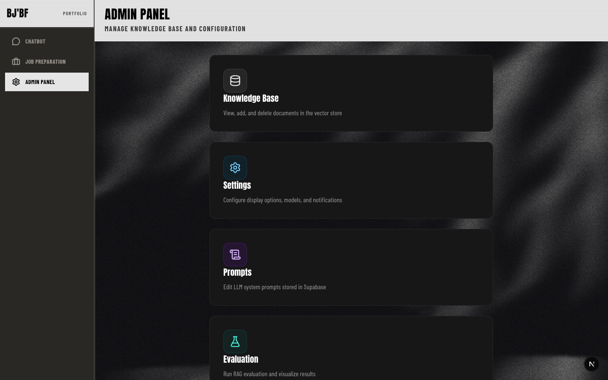
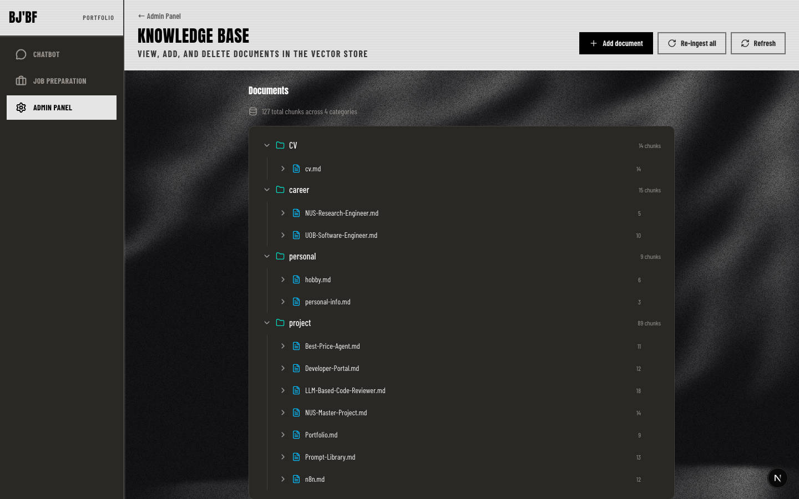
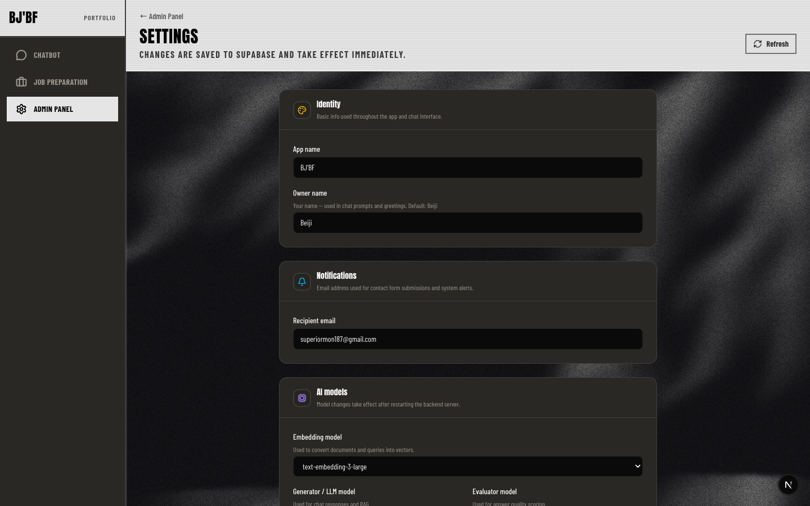
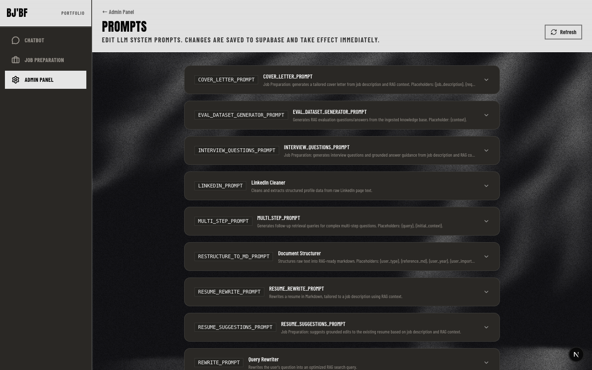
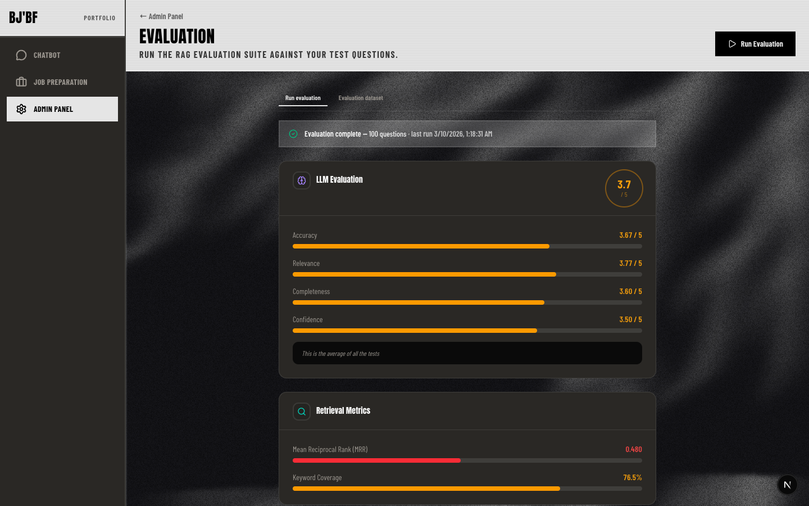

# MyBestFriend Frontend

Interactive chatbot UI for the digital twin — ask anything about Beiji (career, projects, hobbies).

## Features

- **Chatbot** — conversational UI with quick prompts, streaming replies, source citations, local chat history, optional contact flow when the model has no grounding, text input, and voice input (Web Speech API where supported).
- **Job preparation** — paste a job description to generate a tailored cover letter, resume suggestions, interview questions, and extracted keywords, culture fit, and technical requirements.
- **Admin panel** — knowledge base management, settings, editable LLM prompts (Supabase-backed), and RAG/LLM evaluation tooling.
- **Dark-themed UI** — sidebar navigation (Chatbot, Job Preparation, Admin), portfolio link in the header, Caveat + Quicksand typography and indigo-forward styling.

## Showcase

Screenshots are captured with Playwright (see below). Paths are relative to this `frontend/` directory.

### Chatbot

The main experience: ethereal-style background, quick prompts, prompt box with voice, and an empty or in-progress thread.



### Job preparation

Paste a job description, set an optional word limit for the cover letter, then review cover letter, resume notes, and interview prep in separate tabs.



### Admin — hub

Entry points for Knowledge Base, Settings, Prompts, and Eval.



### Admin — Knowledge Base

View and manage documents in the vector store (add/delete as supported by the backend).



### Admin — Settings

Configure display, models, and related options.



### Admin — Prompts

Edit stored system and task prompts used by the LLM pipeline.



### Admin — Eval

Run retrieval and LLM quality evaluations against the configured test set.



## Stack

- Next.js 16 (App Router)
- Tailwind CSS v4
- Lucide React icons
- AI-Native UI design system (Caveat + Quicksand, indigo palette)

## Setup

```bash
npm install
npm run dev
```

Open [http://localhost:3000](http://localhost:3000) (root redirects to `/chat`).

### Regenerating showcase screenshots

Requires dev server on port 3000 (or start one with `npm run dev` in another terminal).

```bash
npm run playwright:install   # once per machine: downloads Chromium under ./.pw-browsers (gitignored)
npm run screenshots
```

Images are written to `docs/screenshots/`. The Playwright config reuses an existing server on `http://127.0.0.1:3000` when present.

## Backend

The chatbot calls the backend API at `http://127.0.0.1:8000` by default. To run the backend:

```bash
cd ../backend
uv run uvicorn src.api_server:app --reload --host 0.0.0.0 --port 8000
```

Set `BACKEND_URL` (or `NEXT_PUBLIC_BACKEND_URL`) in `.env.local` to override the backend URL.

## Voice Input

Voice input uses the browser’s Web Speech API. It works in Chrome, Edge, and Safari. A fallback message is shown if the API is unavailable.
